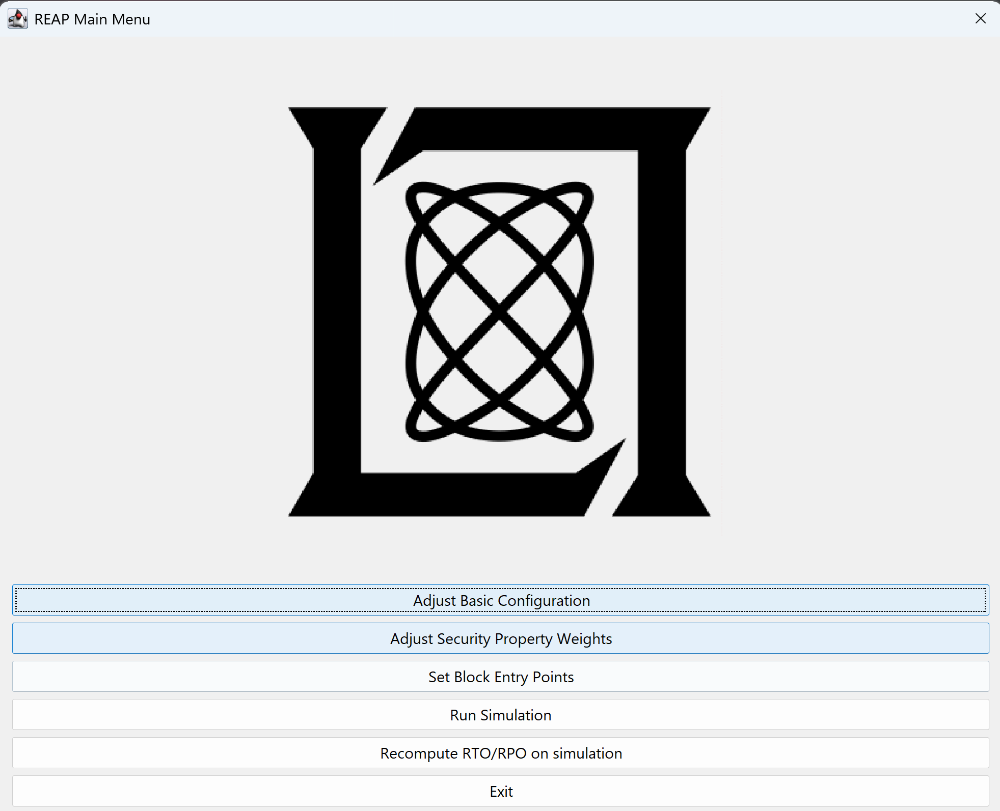
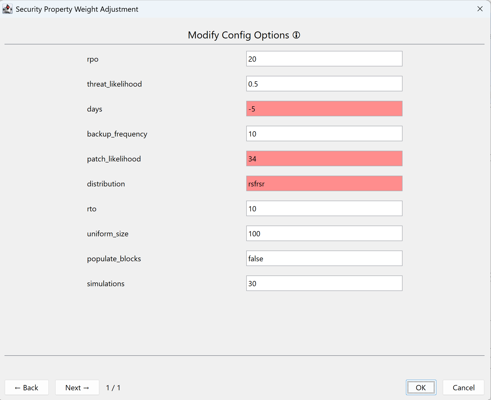
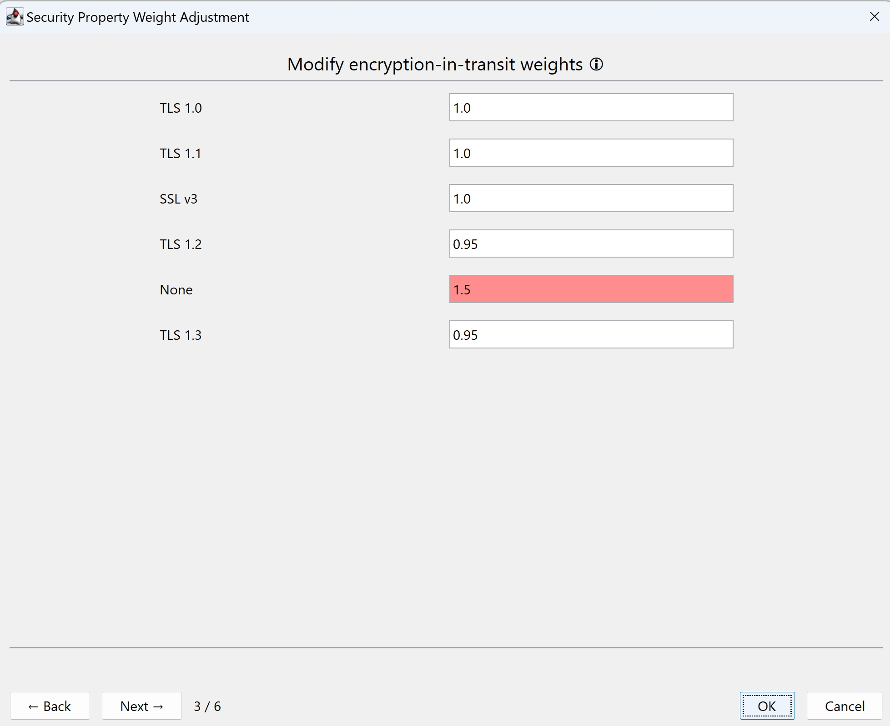
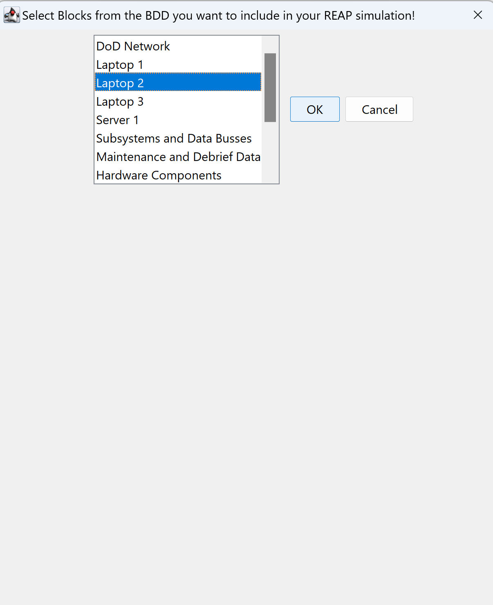

# Risk Evaluation Assessment Plugin (REAP)

## Distribution Statement
DISTRIBUTION STATEMENT A. Approved for public release. Distribution is unlimited.
This material is based upon work supported by the Dept of the Navy under Air
Force Contract No. FA8702-15-D-0001 or FA8702-25-D-B002.
Any opinions, findings, conclusions or recommendations expressed in this material
are those of the author(s) and do not necessarily reflect the views of the Dept
of the Navy.
(c) 2024 Massachusetts Institute of Technology.
The software/firmware is provided to you on an As-Is basis.
Delivered to the U.S. Government with Unlimited Rights, as defined in DFARS Part
252.227-7013 or 7014 (Feb 2014).
Notwithstanding any copyright notice, U.S. Government rights in this work are
defined by DFARS 252.227-7013 or DFARS 252.227-7014 as detailed above.
Use of this work other than as specifically authorized by the U.S. Government may
violate any copyrights that exist in this work.

## Overview
This plugin is debuted in the paper `REAP the Rewards: Bridging Risk Assessment and Secure Application Development Practices`. 
This is the first iteration of the plugin considering a defender model confirming certain cybersecurity controls are in place  
and be able to model how changes in security properties can impact the risk posture of an application. REAP also includes checking compliance with RTO and RPO 
as to better help application owners determine the resilience of their application.

## Setup with the IDE

### Setting up IntelliJ:
-   Download the latest version of IntelliJ and run it
-   Get the MagicDraw initial project setup file into a directory for your development
    -   In the file explorer, navigate to the MagicDraw installation directory
    -   From there, go to /openapi/ide and extract the intellij.zip to a folder somewhere on your machine
    -   I unzipped this file on my Desktop, so I have the folder e.g. `C:\Users\Loid Forger\Desktop\MagicDraw development`
    -   Open the "MagicDraw development.ipr" in IntelliJ, which should be in `C:\Users\Loid Forger\Desktop\MagicDraw development`

### Add the MagicDraw installation directory as a path variable:

-   Go to the menu bar at the top and go to File -> Settings...,
-   Click on the "Appearance & Behavior" and then "Path Variables"
-   To the top left of the variable table, click the "+" icon
-   Set the Name to "MAGIC_DRAW_INSTALL_DIRECTORY"
-   Set the Value to the MagicDraw installation directory (e.g. "C:\\Program Files\\MagicDraw")
-   Click "OK" in the menus until the Settings window is gone

### Clone REAP and setup plugin to run from IDE

-   Clone the Plugin code at `C:\Users\Loid Forger\Desktop\MagicDraw development\`
-   Go to the menu bar at the top and go to File -> New -> Module from Existing Sources...,
-   Make sure the path looks like `C:\Users\Loid Forger\Desktop\MagicDraw development\REAP`
-   Select `Create Module from Existing sources`
-   Click `Next` for everything

### Setting up the configurations:
<Br>

-   In the top right of the screen, select the drop-down menu to the left of the play button
-   Open the menu and select "Edit configurations..."
-   On the left of the pop-up window, select "MagicDraw with all plugins"
-   Set the textbox with "-cp All Plugins" to the module file "-cp Reap"
-   Add the development directory to the program arguments

    -   In the textbox with the long line of text, there is a section that holds the following:

        ```
        -Dmd.plugins.dir=${MAGIC_DRAW_INSTALL_DIRECTORY}/plugins;.. "
        ```

    - Between the ";" and "..", add the directory you are using for plugin development

        -   Make sure to add another semicolon after your plugin directory

        -   e.g., with development in the directory "C:/Desktop/dev"

            ```
            -Dmd.plugins.dir=${MAGIC_DRAW_INSTALL_DIRECTORY}/plugins;C:/Desktop/dev;.. "
            ```

-   Click the "OK" button to close the "Run/Debug Configurations" window

## Few things to note when setting up the IDE

1. Under `File -> Project Structure` make sure you set to using Java 17 constructs. Please make sure you install Java 17 as well.
2. If you have issues with the IDE failing to find the jar files under `libs/` right-click the jar file and click `Add as Library`

## Setup using releases
On the right tab on GitHub, there is a Releases link. 
Click on the link and choose the latest release.
Download the zip file.

Extract the zip file. Inside the new folder, there should be a folder titled `edu.mit.ll.reap` containing only two files:

* reap.jar
* plugin.xml
* blocks.json
* config.json
* `libs` which contains other JAR files used by REAP

Copy that folder and navigate to your MagicDraw installation plugin folder (likely in `C:\Program Files\MagicDraw\plugins`). 
From there, paste the `edu.mit.ll.reap` folder containing the two files and folder there. 
The plug-in should then be ready the next time MagicDraw starts.

## Dependencies
Please check the pom.xml file, which has the list of all packages coming from the Maven Repository, but here are direct links to download the JAR files.
* [Jackson Databind](https://repo1.maven.org/maven2/com/fasterxml/jackson/core/jackson-databind/2.17.0/jackson-databind-2.17.0.jar)
* [Apache POI](https://repo1.maven.org/maven2/org/apache/poi/poi/5.3.0/poi-5.3.0.jar)
* [Apache POI-OOXML](https://repo1.maven.org/maven2/org/apache/poi/poi-ooxml/5.3.0/poi-ooxml-5.3.0.jar)
* [JFree](https://repo1.maven.org/maven2/org/jfree/jfreechart/1.5.5/jfreechart-1.5.5.jar)
* [Gson](https://repo1.maven.org/maven2/com/google/code/gson/gson/2.11.0/gson-2.11.0.jar)

## Motivation
We want to create a MagicDraw plugin that takes in a SysML diagram that shows a software implementation.
Our plugin first enforces that certain values be present in the in-scope blocks and associations.

Then using the `config.json` with its provided assumptions, make estimates on how often/when certain components would be compromised by.
We want to show that by adding certain security controls, all else being equal, the likelihood of a successful cyberattack decreases.


## Plug-In Use
To use this, click on the icon of a hacker in a Guy Fawkes mask on the toolbar. 
Make sure to do this while the BDD to use is the currently opened diagram.

**If you do NOT see the hacker icon, you likely would see an accompanying pop-up showing an error with your input files!**

**If you are NOT running from the IDE** the working directory by default is `C:\Program Files\MagicDraw\plugins`. 
It is highly encouraged you to clone REAP and have the REAP plugin change the working directory to where you cloned REAP. 
This will allow you to provide your own `config.json` and `blocks.json`, and a non-admin place to store the outputs.

### Configuration Files
There are two files that will configure the plugin

1. config.json
2. blocks.json

#### Config JSON
The config file should look similar to this

```json
{
  "distribution" : "normal",
  "uniform_size" : 100,
  "threat_likelihood" : 0.50,
  "patch_likelihood" : 0.50,
  "days" : 300,
  "simulations" : 30,
  "backup_frequency" : 10,
  "rpo" : 20,
  "rto" : 10,
  "populate_blocks" : false
}
```

`distribution` we can either select a normal or uniform distribution when interacting with probabilities. We default to using the normal distribution.  
`threat_likelihood` this is the probability that an APT has compromised the block for a given day.  
`patch_likelihood` this is the probability that a patch to compromised block is successful in removing the APT.  
`days` this is the number of days in one Monte Carlo simulation  
`simulations` is the number of total simulations given the same inputs
`backup_frequency` is the number of days that a block will do a data backup. This is used to compute data lost during an outage  
`rpo` is the recovery point objective, the maximum amount of data loss that is acceptable  
`rto` is the recovery time objective, the maximum amount of time that a system can be down  
`populate_blocks` is a boolean value that will populate the blocks will populate some REAP outputs to the blocks once the experiment is completed

#### blocks.json
```json
{
  "encryption-at-rest" : {
    "None" : 1.0,
    "SSE" : 0.95
  },
  "encryption-in-transit" : {
    "None" : 1.0,
    "SSL v3" : 1.0,
    "TLS 1.0" : 1.0,
    "TLS 1.1" : 1.0,
    "TLS 1.2" : 0.95,
    "TLS 1.3" : 0.95
  },
  "Authentication" : {
    "IAM Role" : 0.95,
    "None" : 1.0
  },
  "Authorization" : {
    "IAM Policy" : 0.95,
    "None" : 1.0
  },
  "Integrity Control" : {
    "None" : 1.0,
    "HMAC" : 0.95,
    "Digital Signature" : 0.95,
    "SSE" : 0.95
  },
  "Deletion Protection" : {
    "Versioning": 0.95,
    "PITR" : 0.95,
    "None" : 1.0
  }
}
```
We use this JSON file to dynamically specify the security property, what values each security property can have, and a weight factor that can decrease the `threat_likelihood` that a specific block is compromised in a specific day. 
The purpose of these properties is to enforce software developers to both keep in mind these security controls and have ways to confirm that these security checks are implemented in code by automated security testing or via CI. 

We propose the following security properties:
* `encryption-at-rest` - the encryption method used to encrypt data at rest
* `encryption-in-transit` - the encryption method used to encrypt data in transit. We can assume an engineer can confirm this property using a TLS scanner on a component. We expect the block should ideally enforce only accepting TLS 1.2+ traffic
* `Authentication` - the authentication method used to authenticate users to the system. We can expect security engineers to confirm this security control using various test causes for authentication/authorization checks.
* `Authorization` - the authorization method used to authorize users to the system. We can expect security engineers to confirm this security control using various test causes for authentication/authorization checks.
* `Integrity Control` - the integrity control method used to ensure data integrity. We can expect security engineers to confirm this security control by corrupting data on the component and confirming that integrity was compromised.
* `Deletion Protection` - the deletion protection method used to ensure data is not deleted. We can expect security engineers to confirm this security control by attempting to delete either the component itself or data on the component and confirm the data is NOT lost.

### Using the GUI
When you activate REAP, you will see the Main Menu


#### Adjust Basic Configuration
This screen allows you to edit the initial `config.json` file. 
When you click OK to provide updates to the basic configurations to REAP, the GUI will highlight red invalid inputs, 
e.g., invalid distribution or negative number of days.


#### Adjust Security Property Weights
This screen allows you to edit the initial weights from `blocks.json` file. 
**If you want to add more security properties, you need to update the `blocks.json` file**. 
You can flip through the security properties on the bottom left of the pages. 
When you select OK to update the weights, the GUI will highlight red invalid inputs, which is providing a negative weight/greater than 1. 


#### Set Block Entry Points
This screen will allow you to select the blocks in the BDD from which we assume the attacker will start with. 
You can select multiple blocks using the CTRL key. All blocks highlighted blue means will be selected for when you run the simulation.


#### Run Simulation
Assuming you have already selected at least one block, and you are content with the configurations, run the simulation(s). 
Upon the simulation completing, the GUI will return, so you can either more simulations or modify your inputs before re-running.

The general workflow for the simulation is:

1. Collect all the blocks in the BDD
2. If the block has a missing security property, create the ValueProperty and set it to `None`.
3. Then REAP will confirm that the blocks are compliant with `blocks.json`, for example, encryption-in-transit can't be weight to `Annie` as that is NOT a valid security property for encryption in-transit.
4. REAP will adjust the default `threat_likelihood` depending on the security properties set on the blocks.
5. REAP will run these steps for each simulation
   * We assume no block starts compromised
   * For each day the following is completed
     * Check if we should add any new blocks to be a possible target for compromise. If a block is compromised, we add all its neighbors as possible victims of cyber-attack
     * For all blocks that are in-scope of an attack, roll the die and determine if the cyber-attack was successful. This is based on `threat_likelihood` and any modifiers from security properties.
     * For all blocks, we roll a die based on `patch_likelihood`, if successful, we assume the block has recovered from a cyberattack.
   * Once all simulations are complete, all outputs are stored in a directory with a timestamp of when the simulation was executed.

#### Recompute RTO/RPO on Simulation
To keep results consistent, this feature allows you to recompute RTO/RPO on a completed simulation. 
You need to provide the folder with the output from past simulation(s). 
When provided,
it will create the following new files within that folder with the updated RTO/RPO compliance given the updated inputs.

### Outputs
All outputs are stored in a folder structure as follows `YYYY-MM-DD_HH-MM-SS`, 
An example is `2024-09-22_21-18-33`, this folder was created on September 22, 2024, at 21:18:33. 

The folder will contain the following:
* `config.json` - the configuration file used for the simulation
* `blocks.json` - the security property weights used for the simulation
* `starting_blocks.txt` - The entry point block for all simulations
* `security_proerties.xlsx` - An Excel sheet showing all the blocks and current security properties
* `simulation_summary.xlsx` - An Excel workbook, each sheet tracking a simulation. This shows the compromised status for each block during that simulation, as well as the number of blocks compromised and in-scope for each day in the simulation
* `simulation_block_view.xlsx` - An Excel workbook, each sheet is assigned for each block in the BDD. This shows the number of times a block is compromised, first day of compromise, total days compromised for each simulation, and data lost during the simulation. The cells are highlighted green if RTO/RPO is compliant, and red otherwise.
* `RPO_RTO_Compliance_rto.xlsx` - An Excel workbook that summarizes how RTO/RPO compliant each block is given all the simulation results.
* Various graphs - There is an X-Y plot tracking days vs. number of blocks compromised/in-scope. Also, a Box and Whisker plot based on the `simulation_block_view.xlsx` metrics

### Image sources
I got the 32 x 32 pixel image of the hacker from [ShareIcon](https://www.shareicon.net/hacker-101375). 
The MITLL logo was obtained from [here](https://www.ll.mit.edu/about/history/lincoln-laboratory-logo).
